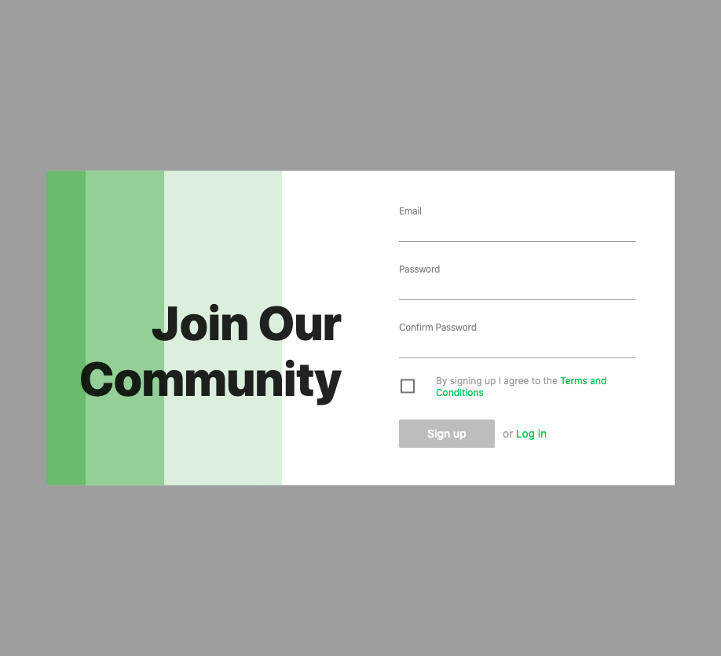
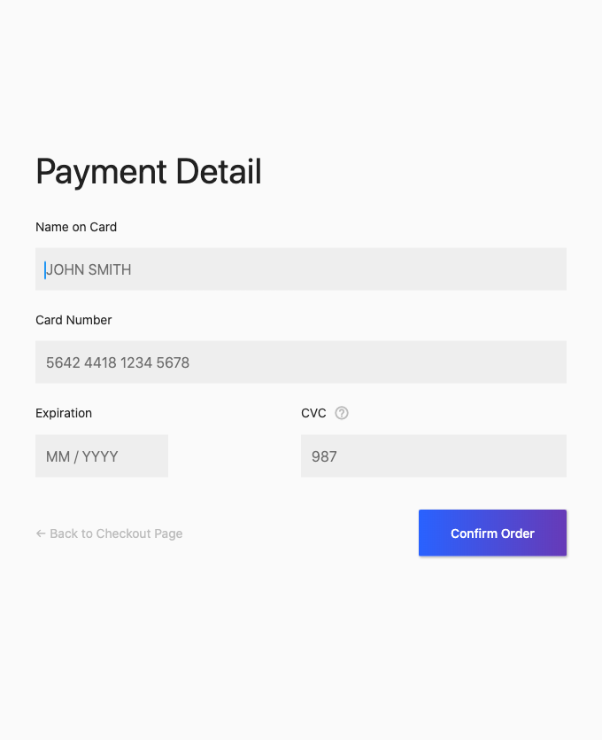
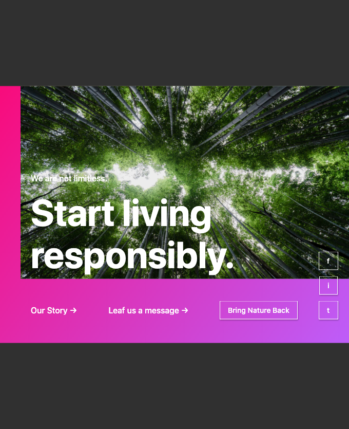
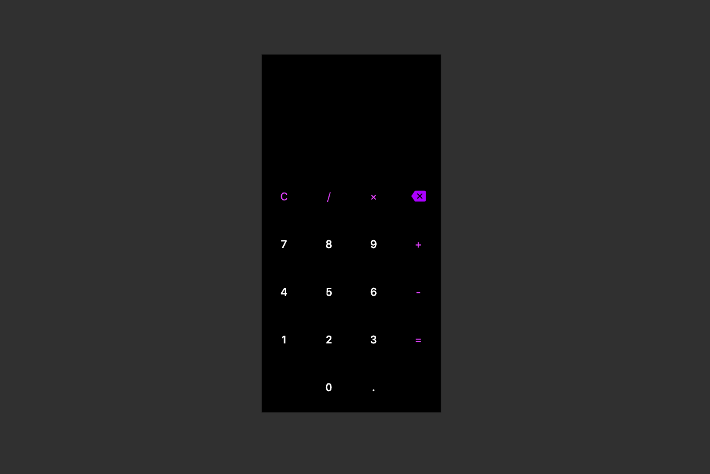
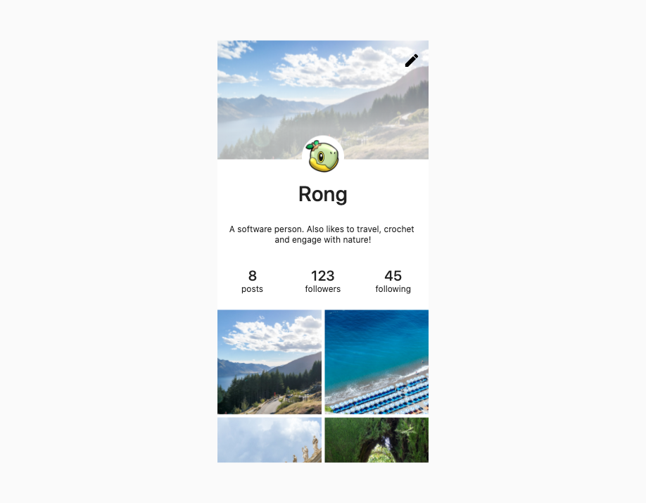
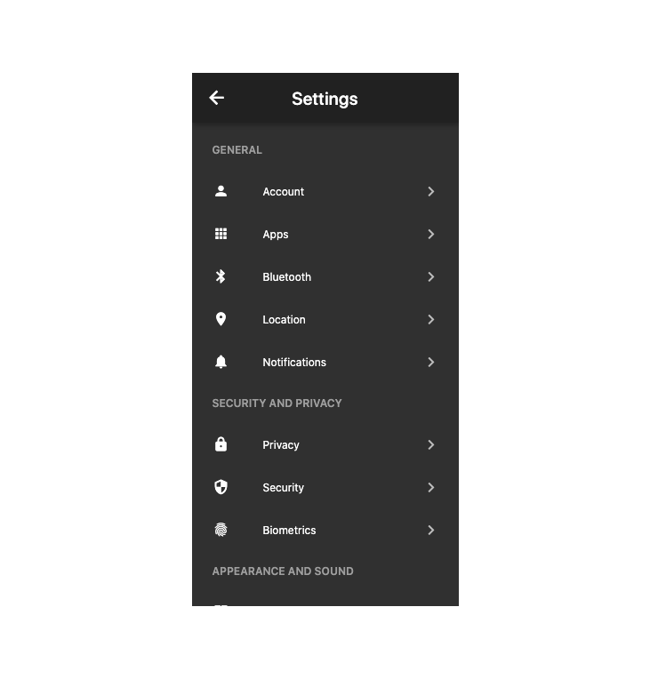
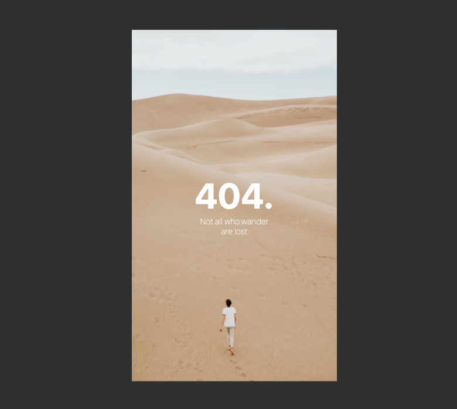
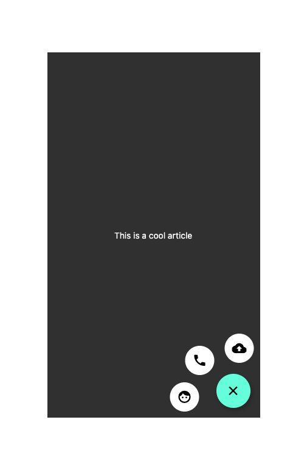
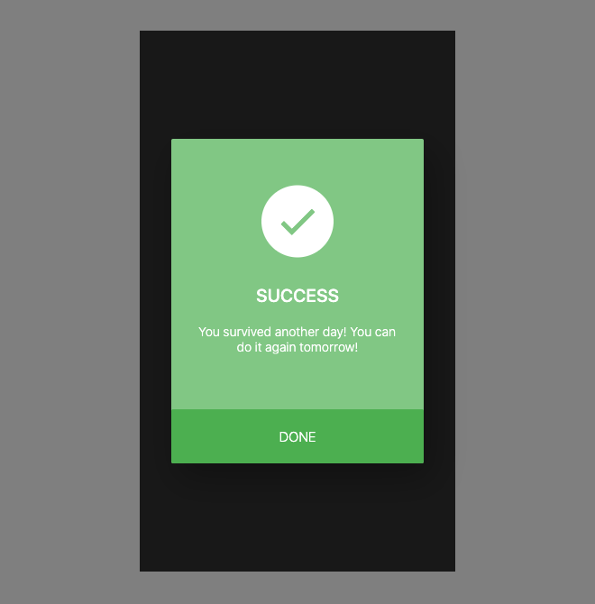

# daily_ui

A new Flutter application.

## How to Run
Dev: `flutter run -d chrome`
Test: `flutter test test/<testName>`

## Daily UI Challenge
There are available as pens on [CodePen](https://codepen.io/collection/nGYxNN) as well.
### Day 001 - Sign Up

- Learnt how to use Form fields and TextEditingController
- Used Stack to stack the colors on the left hand side

### Day 002 - Credit Card Checkout

- New classes: Tooltip, InputFormatter, RaisedButton

### Day 003 - Landing Page

- Used Stack
- New classes: AnimatedContainer, Timer, Random, ThemeData
- [Image Credit](https://unsplash.com/photos/KkqvVpfIzrU)
- [Inspiration](https://www.pinterest.com/pin/838584393107045652/)

### Day 004 - Calculator

- Calculator logic with TDD first
    * Simplify first (don't compute long expressions, just one operator per operation)
    * Do happy path first then edge cases
    * Show error for division error
- Edge Cases to consider
    * 5 + -4 => 5 - 4
    * 5 / -4 => 5 / -4
    * 1 + 2 * 6 = 13
    * 5..2 => 5.2
    * 5.20.1 => 5.2
    * 5 / 0 => how to handle divide by zero error
- Handling overflow with ellipsis
- New Classes: GridView

### Day 006

- New Classes: CustomScrollView, SliverAppBar, FlexibleSpacer, SliverGrid, SliverList, Hero, DecoratedBox

### Day 007

- New Classes: ListView, ListTile, Toggling Dark and Light Mode

### Day 008

- New Classes: FadeTransition

### Day 010

- New Classes: AnimatedPosition, AnimatedSwitcher

AnimatedPosition was pretty much hardcoded though.

### Day 011

- New Classes: Dialog, Transform, SizedBox.expand